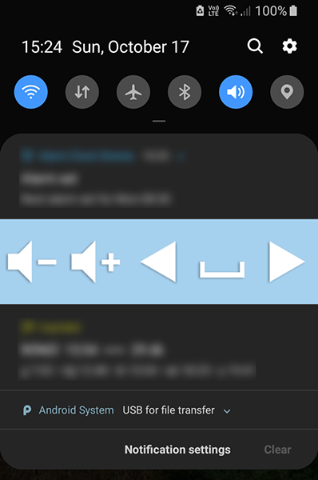

# Unity Mobile Remote Control

This is a hobby Unity project that allows controlling a **64-bit Windows PC** remotely from a mobile/desktop device. Currently, it allows changing the system's volume and emulating mouse&keyboard. I've created this project mainly to control the video playback on my computer from afar, preferably from my couch :grinning: The project is created with *Unity 2019.4.26f1*. It uses Unity's *NetworkDiscovery* component to discover the PC from the remote control device.

## HOW TO

This project requires a companion app on both the Windows PC and the remote control device (tested on *Galaxy S8*). Both of these devices must be on the same network (tested on a home Wi-Fi network).

- To create the companion app for the Windows PC, enable only the **Listener** scene in **Build Settings** and create a **Standalone x86_64 build**. This companion app must stay open for the remote control to work. Alternatively, you can open the Listener scene in Unity and hit Play
- To create the companion app for the remote control device, enable only the **Broadcaster** scene in **Build Settings** and create a build for your target platform

## HIGHLIGHTS

- Keyboard & volume controls (clicking the keyboard icon will prompt the on-screen keyboard, allowing sending arbitrary key inputs to the PC)

- Mouse controls

- Quickly transferring a file from the PC to the companion app (e.g. sending an APK to Android without USB cable)

- *(Android only)* Quick action buttons in the notification bar when the companion app is minimized

